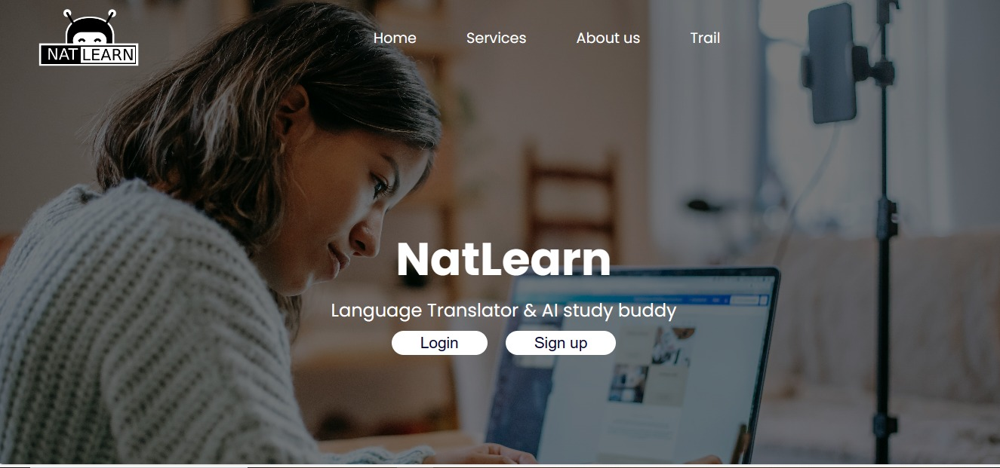
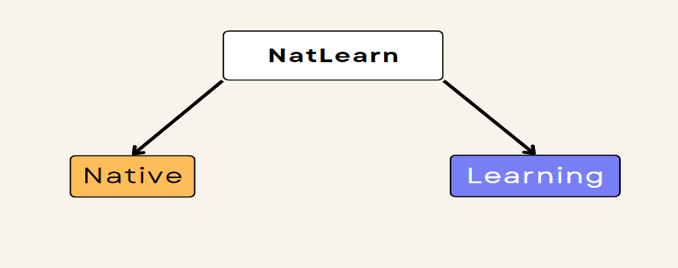
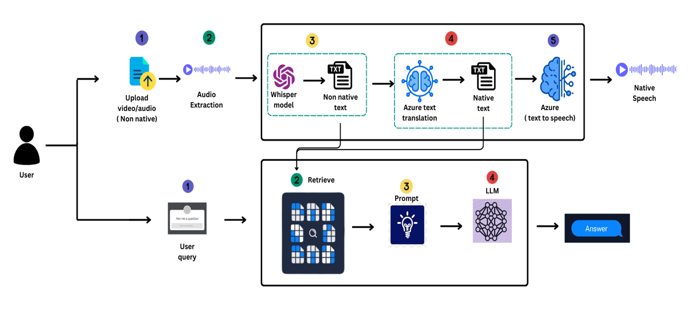
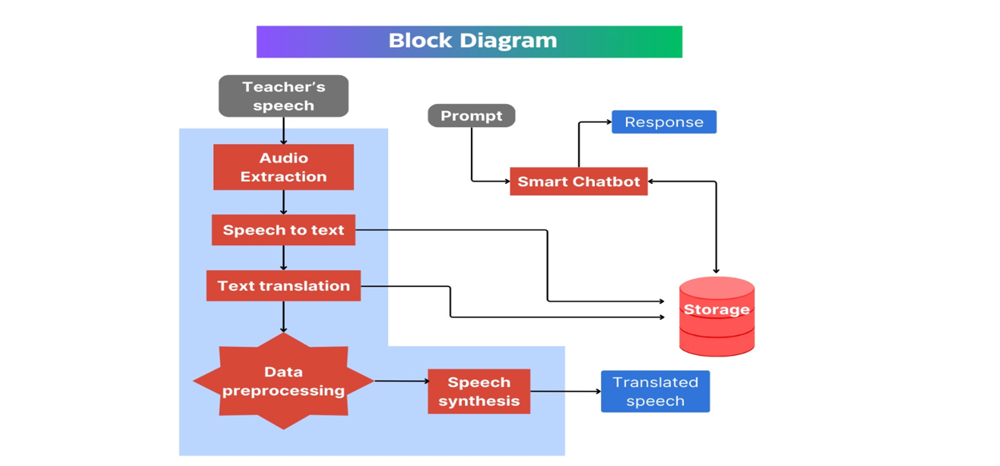

# NatLearn: Multilingual video translator and Context Specific Chatbot



NatLearn is a multilingual video translator and RAG (retrieval augmented generation) chatbot application. It aims to overcome language barriers faced by users all over the world by empowering them to translate videos from non-native languages into their native language. This is complemented by a context-aware chatbot capable of addressing queries by leveraging the information present in the user's uploaded videos. NatLearn uses state-of-the-art AI models and techniques to promote greater accessibility and comprehension in education.



## High Level Diagram
### Diagram 1

### Diagram 2



## Models Used
### For Video/Speech Translation:
- Speech To Text: OpenAI Whisper 
- Text Translation: Microsoft Azure's Text Translation / Meta's NLLB
- Text to Speech: Microsoft Azure's Speech Synthesis / Meta's MMS

### For Chatbot:
- Large Language Model (LLM): LLama2 / OpenAI GPT 3.5/ Mistral
- Embedding Model: Instruct Embedding / OpenAI Ada
- Vector Database: FAISS / ChromaDB

## Installation
1) Install Python 3.10
2) Install pytorch==2.0.0 torchaudio==2.0.0 pytorch-cuda=11.8
3) ``` pip install -r requirements.txt ```


## Usage
```bash 
python manage.py runserver
```

## Contributing

Pull requests are welcome. For major changes, please open an issue first
to discuss what you would like to change.

Please make sure to update tests as appropriate.
